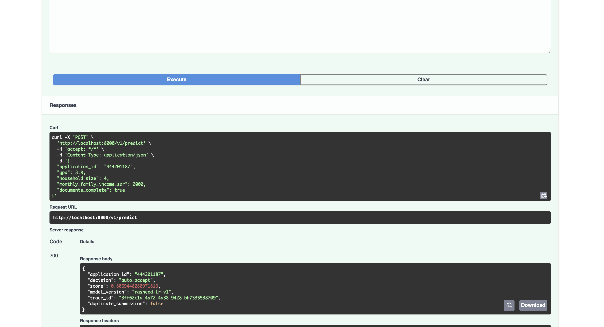
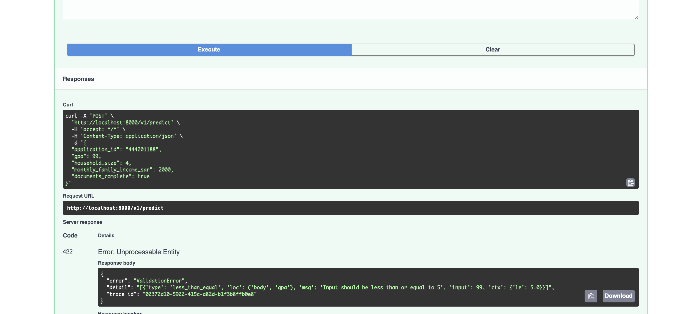
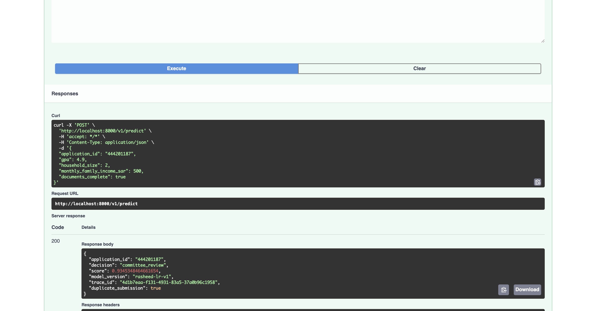

# Rasheed — Student Financial-Aid & Scholarship Screening Service

A backend service that automatically screens scholarship applications and
decides one of three outcomes: **auto-accept**, **send to committee
review**, or **reject**.

This project was completed as part of the SDA-AIE-113 — Software Engineering Practices for AI Systems training program at SDAIA Academy, under the supervision of Abdullah Khalid AlShahrani.

The portfolio demonstrates the practical application of software engineering practices for AI systems — building a production-style AI/ML service through clean architecture, a well-defined API contract, containerization, a layered automated testing suite, a CI/CD pipeline with branch protection, and safe configuration, secrets, and logging management.

Official SDAIA Academy GitHub:
https://github.com/SDAIAAcademy
---

## 1. The concept, in plain terms

A university receives scholarship applications with four pieces of data:
GPA, household size, monthly family income, and whether documents are
complete. The service returns one of three decisions:

| Decision | Meaning |
|---|---|
| `auto_accept` | Strong applicant, no human needs to look at this one |
| `committee_review` | Borderline, or something needs a second look |
| `reject` | Doesn't meet the bar |

**One rule overrides everything else:** if `documents_complete` is
`false`, the decision is *always* `committee_review` — never an automatic
rejection. This rule is enforced in a way that's structurally impossible
to accidentally break (section 3).

---

## 2. Run it in under 10 minutes

    git clone <your-repo-url>
    cd Rasheed-SDAIA-Loba
    docker compose up -d --build
    docker compose ps   # wait ~25s, expect both services (healthy)

    curl -X POST localhost:8000/v1/predict \
      -H "Content-Type: application/json" \
      -d '{"application_id":"APP-1","gpa":3.8,"household_size":4,"monthly_family_income_sar":2500,"documents_complete":true}'

Interactive docs: **http://localhost:8000/docs**. Shut down with
`docker compose down`.

---

## 3. The architecture — four layers, and why each one exists

    src/rasheed/
    ├── domain/      <- pure business rules. No I/O, no framework, no model.
    ├── service/     <- orchestration. Wires domain + model together.
    ├── adapters/    <- the ONLY place external libraries (sklearn, redis) get touched.
    └── api/         <- the HTTP layer. FastAPI routes, request/response shapes.

**The core idea: the model must never see, or be able to override, a
hard business rule.** `domain/policies.py`'s `decide()` checks
`documents_complete` first, unconditionally. `domain/entities.py`'s
`to_features()` deliberately never puts `documents_complete` into the
`FeatureVector` the model receives — so it's not a policy written in a
comment, it's structurally impossible for the model to learn a weight
for it. See `DECISIONS.md` and
`tests/unit/test_features.py::test_documents_complete_never_enters_the_feature_vector`.

**Layer by layer:**

- **`domain/`** — `entities.py` (Application, Decision as an Enum not a
  plain string, RawScore, FeatureVector), `policies.py` (`decide()`,
  with named threshold constants at the top of the file, not magic
  numbers)
- **`service/`** — `interfaces.py` (the `Model` Protocol — neither this
  layer nor `domain/` ever imports sklearn), `duplicate_checker.py`
  (`DuplicateChecker` Protocol + `NullDuplicateChecker`), `scorer.py`
  (`ScholarshipScorer`, the orchestrator)
- **`adapters/`** — the only two files allowed to import an external
  library: `sklearn_model.py` (sklearn) and `redis_duplicate_checker.py`
  (redis)
- **`api/`** — `schemas.py` (`extra="forbid"` + `strict=True` — the
  latter closes a real bug we caught: pydantic's lenient mode was
  silently coercing the string `"yes"` into `True`), `routes.py`
  (`/health`, `/ready`, `/predict`, and `get_scorer()`'s DI seam),
  `app.py` (the FastAPI factory: `lifespan` model loading, structured
  logging, and a unified `ErrorEnvelope` covering both `HTTPException`
  **and** FastAPI's own `RequestValidationError`, so even a malformed
  request still carries a `trace_id`)

**Enforced automatically, not just by convention:** `domain` cannot
import `service`/`adapters`/`api`; `service` cannot import
`adapters`/`api`; `adapters` cannot import `api`. This is `.importlinter`
+ `lint-imports`, run in CI on every push — a violation fails the build
with the exact line number, not a human reviewer's eye.

---

## 4. The model

A small **LogisticRegression** trained on **synthetic data** in
`notebooks/train_rasheed_model.ipynb` — the capstone spec is explicit
that a lightweight model is enough; the engineering discipline *around*
it is what's being graded. Trained externally (not a script in the repo)
so the messy exploratory process stays separate from clean, tested
application code.

**Features the model sees:** `gpa_normalised`, `log_income_per_capita`,
`household_size`. **Not included:** `documents_complete` (section 3).

**Ground truth:** higher GPA and lower income-per-capita both increase
eligibility. The notebook has a built-in sanity check that refuses to
save a directionally-broken model — so a broken artefact can never reach
the repo. To retrain: run the notebook, download the `.joblib`, replace
`models/rasheed_lr_v1.joblib`.

---

## 5. The decision logic

    1. documents_complete == false?  -> COMMITTEE_REVIEW. Stop.
    2. score >= 0.75 AND gpa >= 2.0? -> AUTO_ACCEPT
    3. score <= 0.35?                -> REJECT
    4. otherwise                     -> COMMITTEE_REVIEW

The GPA floor in step 2 is independent of the score threshold on
purpose: the score blends GPA with financial need, so a low-income,
mediocre-GPA applicant could score highly on need alone. The floor says
academic standing must clear its own bar regardless. Full reasoning:
`DECISIONS.md`.

---

## 6. Extension: duplicate-submission detection

A repeat `application_id` downgrades what would've been `auto_accept` to
`committee_review` (`"duplicate_submission": true` in the response) —
never an automatic reject, same philosophy as the missing-documents
rule. `application_id` represents the *student*, not a form-submission
event, so a "duplicate" means a real re-application, a double-submit, or
someone tweaking numbers hoping for a different result.

Built with the same Protocol + adapter + null-object pattern as the
model itself, so the feature is fully optional — the service works with
zero Redis dependency if `RASHEED_REDIS_URL` isn't set. Backed by
`duplicate-cache` (Redis) in `docker-compose.yml`, gated on a real
`service_healthy` check. The connection string is `SecretStr` in
`Settings` (section 11) since a real deployment's Redis URL would carry
a password.

---

## 7. The API layer, in detail

| Endpoint | Purpose |
|---|---|
| `GET /v1/health` | Liveness — is the process running at all |
| `GET /v1/ready` | Readiness — has the model finished loading (503 until it has) |
| `POST /v1/predict` | The scoring endpoint |

Two separate health endpoints because conflating them means a load
balancer could route real traffic to an instance whose model hasn't
finished loading, producing confusing 503s that look like real errors.

**Model loading + warm-up happen at startup, never at import time.**
`lifespan` in `app.py` loads the model once, builds the scorer, then
immediately runs one real scoring call against a synthetic "warm-up"
application before logging `model_loaded` — so the first real user
request never pays the cost of the model's first inference call; that
cost is absorbed before `/v1/ready` ever reports `true`.

**Every response — success or error — carries a `trace_id`,** either
from the caller's `X-Trace-Id` header or freshly generated. This
includes FastAPI's own automatic validation errors, not just
application-level exceptions: both are caught by dedicated handlers in
`app.py` and rendered through the same `ErrorEnvelope` shape.

**Structured JSON logs, allowlisted, not blocklisted.**
`JsonLogFormatter` only ever copies three named fields (`trace_id`,
`application_id`, `decision`) onto the output — never `gpa`, income, or
household size. Verified directly: a real request was sent and its log
line inspected to confirm no application data leaked.

**A 500 never leaks internals.** An unexpected exception in
`ScholarshipScorer.score()` returns a generic message and status 500;
the real traceback is logged server-side via `logger.exception(...)`,
never returned to the client. Tested in
`tests/integration/test_predict_api.py::test_predict_500_hides_internal_details`.

---

## 8. Testing strategy — the three-level pyramid

    tests/
    ├── unit/           <- pure logic, milliseconds, no I/O
    ├── integration/    <- the real FastAPI app via TestClient, ~50ms/test
    └── behavioural/    <- the REAL trained model, marked @pytest.mark.slow

**Placement rule:** test a thing at the lowest level that can catch its
failure. The missing-documents rule gets a unit test on `decide()`
directly (no HTTP, no model needed) *and* an integration test through
the real API (proves the wiring, which the unit test alone can't).

- **Unit** — test doubles only (`ConstantModel`,
  `InMemoryDuplicateChecker`). Covers `decide()`'s bands/boundaries,
  `to_features()`'s math and the documents-complete exclusion guarantee,
  the duplicate extension's downgrade-only behaviour.
- **Integration** — the real `create_app()`, model swapped via
  `app.dependency_overrides[get_scorer]`. Covers the `/predict`
  contract, a 14-file malformed-payload corpus (each must 4xx, never
  crash or 200), the 500-hides-internals guarantee, `/health`/`/ready`
  before and after real `lifespan`.
- **Behavioural** (`@pytest.mark.slow`) — the real model. Invariance
  (`application_id` doesn't move the score), directional (higher GPA
  never lowers score), golden reference (500 scored applications vs. a
  versioned CSV — any diff means an unintended skew or a real change
  needing review; regeneration via `make regen-golden` is a deliberate,
  reviewed act, never a way to silence a failing test).

**Coverage:** `fail_under = 80`, branch coverage across
`domain/`/`service/`/`api/`. `adapters/redis_duplicate_checker.py` is
excluded from the gate — thin I/O with no branching logic, would need a
real Redis instance to test meaningfully. The logic it wraps *is*
tested, via the in-memory fake.

---

## 9. Containerization

**Multi-stage Dockerfile.** `builder`: compiler toolchain, installs deps
into `/opt/venv`; nothing from this stage ships. `runtime`: fresh
`python:3.12-slim`, copies only `/opt/venv` and the model file.

**464 MB** (requirement: ≤ 500 MB). Achieved by ordering the dependency
layer separately from the source layer for cache efficiency, dropping
`uvicorn[standard]`'s extras (`uvloop`/`httptools`/`watchfiles`/
`websockets` — dev-reload/perf extras, unneeded in a container), and
dropping `curl` (~15MB) in favour of a one-line Python `urllib`
healthcheck.

**Non-root:** runs as `appuser` (uid 10001) — verified with
`docker run --rm rasheed:dev whoami`.

**Clean shutdown:** exec-form `CMD` makes `uvicorn` PID 1, receiving
`SIGTERM` directly. Verified: container stopped in 0.4s (not the
10s force-kill default), logs showed the full graceful sequence.

**Healthcheck targets `/v1/ready`, not `/v1/health`** — confirms the
model actually loaded, not just that the process exists. Both the
Dockerfile's `HEALTHCHECK` and `docker-compose.yml`'s `healthcheck:`
must agree on this — a compose-level healthcheck silently overrides the
image's own, which was a real bug caught and fixed here (both initially
referenced `curl`, no longer present in the trimmed image).

**`docker-compose.yml`** runs `rasheed-api` alongside `duplicate-cache`,
gated on `service_healthy`. The only environment variable set is
`RASHEED_REDIS_URL` — `model_path` and every threshold use their
`Settings` defaults, nothing else needs injecting.

---

## 10. CI/CD pipeline

`.github/workflows/ci.yml` runs on every push. `lint-and-typecheck` and
`test` run **in parallel** — neither waits on the other, so a single
push surfaces every problem at once:

    lint-and-typecheck ---
                            \
                             image-smoke-test --> publish
    test ------------------/

- **`lint-and-typecheck`** — `ruff check`, `lint-imports` (architecture
  contracts), `mypy` (with `pydantic.mypy` enabled in `pyproject.toml`
  so mypy correctly reads pydantic `Field()` defaults/validators instead
  of raising false "missing argument" errors)
- **`test`** — `pytest -m "not slow"`, 80% coverage gate baked into
  `pyproject.toml`
- **`image-smoke-test`** — waits for **both** jobs above, then builds
  the real image, starts it, waits for `/v1/ready`, sends one valid and
  one malformed request (mirrors the manual local smoke test)
- **`publish`** — only on push to `main`, never a feature branch or PR.
  Pushes to GHCR tagged with the exact commit SHA, never `latest`. The
  image name is explicitly lowercased in its own step, since
  `${{ github.repository }}` preserves original casing and GHCR
  requires lowercase.

**Branch protection on `main`:** all three non-publish checks required,
at least one PR approval required, force-push disabled.

---

## 11. Configuration, secrets, and logging discipline

Everything lives in one place: `src/rasheed/config.py`'s `Settings`
(pydantic-settings, `RASHEED_` prefix). Nothing else reads `os.environ`
directly — verified with a repo-wide grep.

**Fail-fast, two layers deep:**
- `extra="forbid"` — an unknown env var like `RASHEED_ACEPT_THRESHOLD`
  (typo) crashes `Settings()` immediately with a message naming the bad
  field, instead of being silently ignored.
- A `@field_validator` on `model_path` checks the file actually exists.
  Even with a sensible default, if that file is genuinely missing
  wherever the process runs, `Settings()` refuses to construct — the
  failure names the field and the exact missing path, not a deep
  `joblib`/pickle traceback several frames down.

**Bounded values:** `accept_threshold`, `reject_threshold`, and
`min_gpa_for_auto_accept` all use `ge=`/`le=` — a fat-fingered `8.5` now
fails validation at startup, not silently in production.

**Secrets typed as secrets:** `redis_url` is `SecretStr | None`, not a
plain string. Verified directly — `repr()` and `str()` both print
`**********`; only the explicit `.get_secret_value()` call in `app.py`'s
`lifespan` (one, grep-able seam) ever reads the real value.

**No secrets currently exist in this project.** Verified two ways: a
full git-history scan for secret-like patterns and for any accidentally
committed `.env` file (both clean), and a real `gitleaks` scan
(`gitleaks detect --source . --no-git -v` -> `no leaks found`). The
`SecretStr` field exists so that if a real deployment ever configures a
password-protected Redis, the masking is already in place and tested,
not retrofitted under pressure later.

**The `gitleaks` drill, and what it actually taught:** a fake GitHub
token was planted to confirm detection works. The first attempt — a
low-entropy placeholder of 36 repeated `X` characters — was **not**
flagged: `gitleaks`'s `github-pat` rule combines a regex match with an
entropy check, and a maximally repetitive string falls below the
threshold for a genuine secret. A second attempt with realistic,
high-entropy characters (entropy 5.12) was flagged correctly. Full
write-up, plus the correct incident-response order (rotate first, clean
git history second — deleting a commit never un-leaks an already-
committed credential), is in `INCIDENT.md`.

| Setting | Env var | Default |
|---|---|---|
| Model path | `RASHEED_MODEL_PATH` | `models/rasheed_lr_v1.joblib` |
| Accept threshold | `RASHEED_ACCEPT_THRESHOLD` | `0.75` (bounded 0.0–1.0) |
| Reject threshold | `RASHEED_REJECT_THRESHOLD` | `0.35` (bounded 0.0–1.0) |
| Min GPA for auto-accept | `RASHEED_MIN_GPA_FOR_AUTO_ACCEPT` | `2.0` (bounded 0.0–5.0) |
| Log level | `RASHEED_LOG_LEVEL` | `INFO` |
| Redis URL (secret) | `RASHEED_REDIS_URL` | `None` (feature disabled) |
| Build provenance | `RASHEED_GIT_SHA` | `"dev"` |

---

## 12. Local development

    python3 -m venv .venv
    source .venv/bin/activate
    make install          # pip install -e ".[dev,api]"

    make test              # unit + integration, ~1s, 80%+ coverage gate
    make test-slow          # behavioural suite against the real model
    make lint                # ruff + import-linter architecture check
    make typecheck            # mypy

    make image               # docker build
    make up                   # docker compose up -d --build
    make smoke                # curl /v1/health and /v1/ready
    make down                 # docker compose down

    make regen-golden          # regenerate the golden reference file (deliberate act only)

    gitleaks detect --source . --no-git -v   # secret scan (see section 11)

---

## 13. Full project structure

    Rasheed-SDAIA-Loba/
    |-- .github/workflows/ci.yml      # CI/CD pipeline (parallel lint+test)
    |-- .importlinter                 # architecture layer contracts
    |-- .dockerignore
    |-- Dockerfile                    # multi-stage build
    |-- docker-compose.yml            # rasheed-api + duplicate-cache (Redis)
    |-- Makefile                      # unified command interface
    |-- pyproject.toml                # packaging, pytest, coverage, ruff, mypy (+pydantic plugin)
    |-- requirements.lock             # pinned runtime dependencies (prod-only)
    |-- README.md                     # this file
    |-- BENCHMARKS.md                 # real measured numbers
    |-- DECISIONS.md                  # documented engineering decisions
    |-- INCIDENT.md                   # gitleaks drill + rotate-first response order
    |-- models/rasheed_lr_v1.joblib   # trained model artefact (committed)
    |-- notebooks/train_rasheed_model.ipynb  # training notebook (committed)
    |-- scripts/
    |   |-- generate_golden_file.py
    |   `-- startup_time.sh
    |-- payloads/malformed/           # 14-file malformed-request test corpus
    |-- src/rasheed/
    |   |-- config.py                 # Settings: fail-fast, bounded, SecretStr-aware
    |   |-- domain/
    |   |   |-- entities.py           # Application, Decision, RawScore, FeatureVector
    |   |   `-- policies.py           # decide() -- the core business rule
    |   |-- service/
    |   |   |-- interfaces.py         # Model Protocol
    |   |   |-- duplicate_checker.py  # DuplicateChecker Protocol + NullDuplicateChecker
    |   |   `-- scorer.py             # ScholarshipScorer (the orchestrator)
    |   |-- adapters/
    |   |   |-- sklearn_model.py      # real Model implementation
    |   |   `-- redis_duplicate_checker.py  # real DuplicateChecker implementation
    |   `-- api/
    |       |-- schemas.py            # request/response contracts
    |       |-- routes.py             # /health, /ready, /predict
    |       `-- app.py                # FastAPI factory, lifespan + warm-up, logging
    `-- tests/
        |-- conftest.py                # shared fixtures (client_factory, real_model, ...)
        |-- unit/                      # pure logic, test doubles only
        |-- integration/                # real FastAPI app via TestClient
        `-- behavioural/                 # real trained model, marked @pytest.mark.slow

  ---
  ## 14. API walkthrough (Demo)

The API can also be tested interactively through Swagger UI at `http://localhost:8000/docs`.

### Step 1: Valid request

A valid scholarship application is submitted with a GPA of `3.8`, a household size of `4`, monthly family income of `SAR 2,000`, and complete documentation.

```bash
curl -X POST http://localhost:8000/v1/predict \
  -H "Content-Type: application/json" \
  -d '{"application_id":"444201187","gpa":3.8,"household_size":4,"monthly_family_income_sar":2000,"documents_complete":true}'
```

The service returns `auto_accept` for this application. The response also includes a `trace_id`, which allows the request to be correlated with its corresponding server-side log entry.



### Step 2: Invalid request

The API validates incoming data before it reaches the scoring logic. Here, the GPA is set to `99`, which is outside the valid `0–5` range.

```bash
curl -X POST http://localhost:8000/v1/predict \
  -H "Content-Type: application/json" \
  -d '{"application_id":"444201188","gpa":99,"household_size":4,"monthly_family_income_sar":2000,"documents_complete":true}'
```

The service rejects the request with a `422` validation error instead of processing an invalid application. The response follows the same error envelope and includes a `trace_id`.



### Step 3: Duplicate application

The third example demonstrates the duplicate-submission extension. When the same `application_id` is submitted again, the service identifies it as a duplicate.

```bash
curl -X POST http://localhost:8000/v1/predict \
  -H "Content-Type: application/json" \
  -d '{"application_id":"444201187","gpa":4.9,"household_size":2,"monthly_family_income_sar":500,"documents_complete":true}'
```

The response includes `"duplicate_submission": true`. A duplicate that would otherwise qualify for `auto_accept` is downgraded to `committee_review` rather than being automatically rejected.


